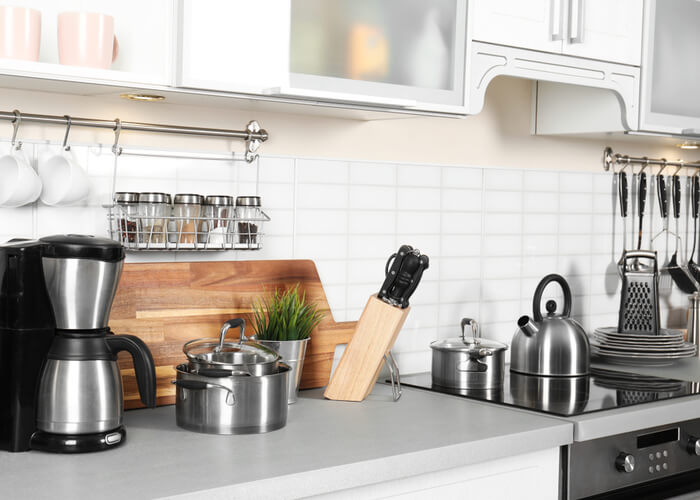

# Kitchenware Classification

)

This is a project that is organized by [Datatalks.Club](https://datatalks.club/). In this competition, one has to train a deep learning model in tensorflow or pytorch to classify kitchenware items. I used tensorflow and keras for this task. The kitchenware items are:
- cups
- glasses
- plates
- spoons
- forks
- knives

As an image classification model, when given the image of one of the above-listed kitchenware items, the model will output probailities for each of the six classes. The highest probability serves as the model's final classification. 

## Image Dataset

You can get the dataset to reproduce the classification on your own system from the [Kaggle Competition page](https://www.kaggle.com/competitions/kitchenware-classification/overview). I would recommend using a GPU for this task because a CPU would take hours if not days. I used the free GPU from [Saturn Cloud](https://saturncloud.io/). Saturn Cloud gives 30 hours of free GPU every month. 

## Exploratory Data Analysis

Since deep learning models don't need extensive data analysis and exploration, I did only minimal EDA. It was discovered that in the dataset, there were 6 kitchenware items or classes as outlined above. The train dataset was divided into 80 percent final train and 20 percent validation. Which means there were 4447 images in the final train dataseet and 1112 images in the validation dataset. The test dataset had 3808 images. 

Most of the images had distracting items at the borders, that was why data augmentation was necessary. You would notice that I carried out extensive data augmentation in order to make the model not overfit due to the distracting features in the images. 

##  Model Training

The model was trained on tensorflow with a pre-trained convolutional network (CNN) model, Xception, with two convolutional layers. Then a hidden layer gave good results using relu activation. The output layer was trained using softmax. 

You can find all this information on the `notebook-kitcheware.ipynb` file in the repo.

## Python Script

The python script for building the model is found in the `train.py` file. A full run down of the activities carried out for training is found in the `notebook-kitchenware.ipynb` file. The script only has the essential steps for producing the best model. 

## Model Deployment

To kickoff model deployment, I first converted the tensorflow kitchenware classification model, `xception_vlarge2_31_0.968.h5` to a tensorflow lite model, `kitchenware_model.tflite`. This is to make it possible to make a lightweight Docker image and also to use it in the streamlit app. Also, this model will be used in the flask app for local deployment. 

I then collected some test images from Google to use in the deployment stage. Those images are in the images folder. 

The model will then be deployed on flask locally and a Docker image built for deployment to the cloud. 

### Flask deployment

To deploy on flask, you need to have a virtual environment. I used pipenv. If you don't have pipenv, you can install it with this command:

``` pip install pipenv ```

Then create the environment by first navigating to the directory of our project. When there, run this pipenv command:

``` pipenv shell ```

You are immediately in a virtual environment for the project. 

Next is to install the packages or dependencies you need for the project to run. 

``` pipenv install -r requirements.txt ```

Then you need to run the server. 

If on a linux machine, use this command:

``` gunicorn --bind 0.0.0.0:9696 predict:app ``` 

But if on a windows machine, use this command:

``` waitress-serve --listen=0.0.0.0:9696 predict:app ```

The next thing to do is to open a second terminal, enter the virtual environment using ``` pipenv shell ```. Then, run the test file:

``` python3 test.py ```

That's all. You have run the project locally on a flask server. 

### Building a Docker image

You need a Docker image to deploy it to the cloud like AWS or Heroku. 

TBC

